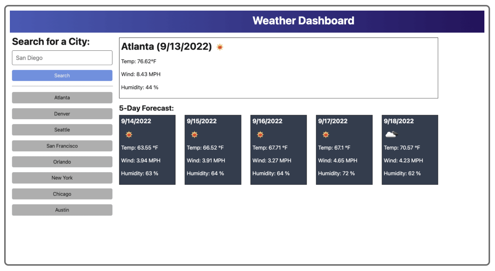

# OpenWeather-API-App

## Description

A weather dashboard application that calls the OpenWeather API and renders data in the browser. This project leverages external APIs, allowing users to access weather data by making requests with specific parameters to a URL. The app retrieves and consumes this data via a server, ensuring real-time weather updates.

- **Motivation:** To build an interactive weather application that allows users to check weather conditions in different cities easily.
- **Purpose:** To provide a simple and intuitive interface for users to retrieve current and future weather forecasts.
- **Problem Solved:** Helps users quickly access weather information for any city, including temperature, wind speed, humidity, and a 5-day forecast.
- **What I Learned:** Implementing API calls using TypeScript, handling server-side and client-side integration, and deploying applications using Render.

## Table of Contents

- [Installation](#installation)
- [Usage](#usage)
- [Credits](#credits)
- [License](#license)
- [Badges](#badges)
- [Features](#features)
- [How to Contribute](#how-to-contribute)
- [Tests](#tests)
- [Render Link](#render-link)

## Installation

1. Clone the repository:
   ```sh
   git clone https://github.com/lunahoushmand16/OpenWeather-API-App
   ```
2. Navigate to the project folder:
   ```sh
   cd OpenWeather-API-App
   ```
3. Install dependencies:
   ```sh
   npm install
   ```
4. Run the application:
   ```sh
   npm run start
   ```

## Usage

- The application allows users to search for cities and view the current and future weather conditions for that city.
- The search history is saved, allowing users to revisit previous searches quickly.
- Displays the city name, weather conditions, temperature, humidity, and wind speed.
- Provides a **5-day weather forecast** for the selected city.

### Example:

```
GIVEN a weather dashboard with form inputs
WHEN I search for a city
THEN I am presented with current and future conditions for that city, and that city is added to the search history
WHEN I view current weather conditions for that city
THEN I am presented with the city name, the date, an icon representation of weather conditions, a description of the weather for the icon's `alt` tag, the temperature, the humidity, and the wind speed
WHEN I view future weather conditions for that city
THEN I am presented with a 5-day forecast that displays the date, an icon representation of weather conditions, the temperature, the wind speed, and the humidity
WHEN I click on a city in the search history
THEN I am again presented with current and future conditions for that city
```

### Sample Output:
```md
City: Austin
Date: 03/04/2025
Weather: Clear Sky
Temperature: 75°F
Wind Speed: 5 mph
Humidity: 40%
```

### Screenshots:




## Credits

- Created by **[Luna Houshmans](https://github.com/lunahoushmand16)**
- Built with [TypeScript](https://www.typescriptlang.org/docs/handbook/2/functions.html) and [Express.js](https://expressjs.com/)
- Uses [OpenWeather API](https://openweathermap.org/api) for weather data retrieval
- Deployed on [Render](https://render.com)
- [GitHub Markdown Guide](https://docs.github.com/en/get-started/writing-on-github/getting-started-with-writing-and-formatting-on-github/basic-writing-and-formatting-syntax)

## License

This project is licensed under the **MIT License**. See the [LICENSE](LICENSE) file for details.

## Badges


## Features

- Real-time weather updates for any city.
- Saves search history for quick access to previous searches.
- Displays detailed weather conditions including temperature, humidity, and wind speed.
- Provides a **5-day weather forecast** with daily weather summaries.
- Deployed on Render for live access.

## How to Contribute

1. Fork the repository
2. Create a new branch: `git checkout -b feature-name`
3. Make changes and commit: `git commit -m 'Added new feature'`
4. Push changes: `git push origin feature-name`
5. Open a pull request

## Tests

1. Open the **Render deployment link**.
2. Search for a city by name and verify that the current weather and forecast are displayed correctly.
3. Try deleting cities from the search history.
4. Test error handling by entering an invalid city name.

## Render Link

[Live Demo on Render](#)